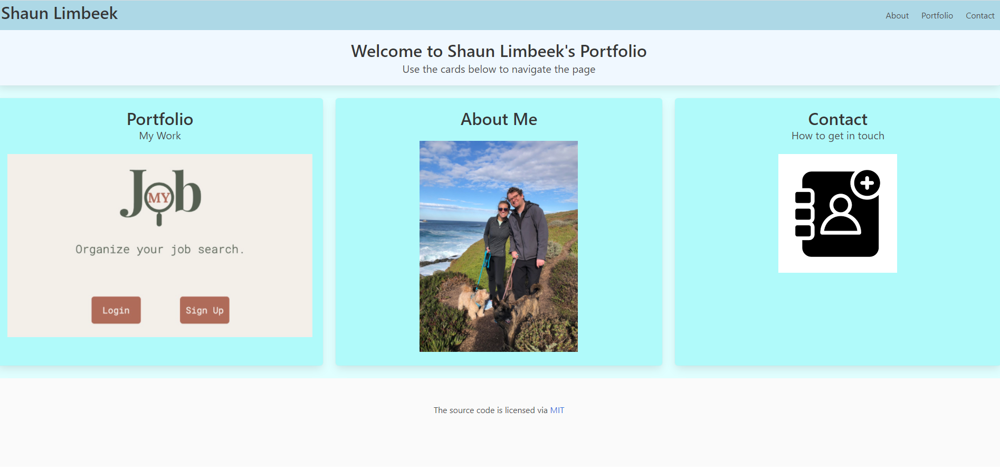

# Shaun Limbeek's Portfolio

## Summary

The request was to create a set of three interconnected webpages to serve as a portfolio for my ongoing work with coding.  The three pages are an index, a portfolio page, and a contact page.  These pages link to each other, and are created to be responsive to different browser page sizes. The index page looks like this:



* [See Live Site](https://afternoon-temple-06204.herokuapp.com/)

## Key Pieces of Code

There are a couple of key pieces of code within these portfolio pages that allows the page to run as intended. The first of these is the router functionality that was built out in the react app to deliver the different pages via link routes rather than hrefs.

```
<Switch>
    <Route exact path="/" component={Home} />
    <Route exact path="/portfolio" component={Portfolio} />
    <Route exact path="/about" component={About} />
    <Route exact path="/contact" component={Contact} />
</Switch>
```
<br>

The second key piece of code is to create a catch all final route that displays an error message for the user if they navigate to a route that doesn't exist.

```
<Route component={NoMatch} />
```

This code comes after all of our defined route paths, and exists to catch all other paths sent to our server by the user.

<br> 

The final important piece of code in the pages is having a sticky footer, which has a thick top border. To acheive this, I used the following html code:

```
    <footer class="footer pb-2 bg-dark"><span class="border-top"></span>
        <div class="footer" id="break">
            <p class="break">.</p>
        </div>
        
        <p id="footer">&copy; Copyright</p>
    </footer>
```

and the following CSS code:

```
#break {
    background-color: #4AAAA5;
    color: #4AAAA5;
    font-size: 6px;
}

#footer {
    color:#4AAAA5;
    text-align: center;
    font-style: 24px;
    font-family:'Trebuchet MS', 'Lucida Sans Unicode', 'Lucida Grande', 'Lucida Sans', Arial, sans-serif  ;
}
```


<hr>

## Built With

* [HTML](https://developer.mozilla.org/en-US/docs/Web/HTML)
* [CSS](https://developer.mozilla.org/en-US/docs/Web/CSS)
* [React](https://reactjs.org/)
* [Path](https://www.npmjs.com/package/path)
* [Express](https://www.npmjs.com/package/express)
* [Bulma](https://bulma.io/)

## Licenses

 
The MIT License (MIT); Copyright 2011-2020 Twitter, Inc.; Copyright 2011-2020 The Bootstrap Authors

## Authors

### **Shaun Limbeek** 

- [Link to Github](https://github.com/slimbeek6/)
- [Link to LinkedIn](https://www.linkedin.com/in/shaun-limbeek/)
- [Link to Portfolio](https://afternoon-temple-06204.herokuapp.com/)
